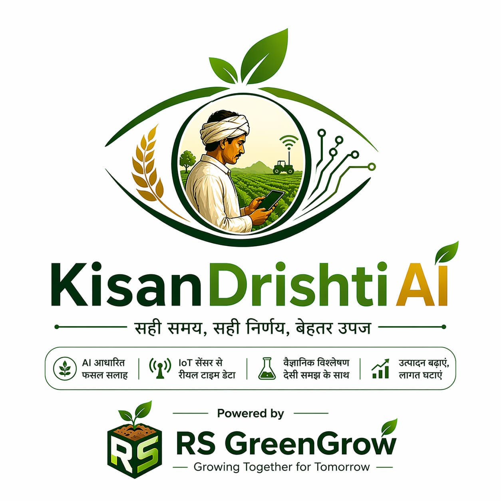

# 🌾 KisanDrishti AI: Precision Intelligence for Indian Agriculture

<p align="center">
  
  <br>
  <b>KisanDrishti AI</b> is a production-grade Mobile SPA platform designed to empower Indian farmers with scientific precision, real-time data, and AI-driven agricultural insights.
</p>

---

## 📸 Platform Glimpse

| Home Dashboard | Weather Intelligence | Fertilizer Advisor |
| :---: | :---: | :---: |
|  |  |  |

---

## 🚀 Key Features

### 🧪 Precision Fertilizer Advisor (STCR)
- **Scientific Prescription**: Uses the **Soil Test Crop Response (STCR)** method to generate fertilizer doses for specific target yields.
- **Unit Scaling**: Automatically scales recommendations for **Acre, Hectare, or Bigha**.
- **AI Explanation**: Integrated with **AWS Bedrock** to explain *why* specific fertilizers are needed in plain Hindi or English.

### 🌤️ Weather Dashboard & AI Report
- **Agricultural Outlook**: High-resolution 48-hour charts for Temperature, Humidity, and Wind speed.
- **Safe Application Windows**: AI analyzes hourly data to recommend the exact hours today to apply fertilizers or pesticides safely.
- **10-Day Forecast**: Smart projections with rainfall probability to guide irrigation.

### 📈 Real-time Market Prices
- **Agmarknet Integration**: Fetches region-specific commodity prices from official government sources.
- **Smart Caching**: Region-wise caching (refreshed twice daily) to handle high user volume efficiently.
- **Price Trends**: Visual indicators for market trends (Up/Down/Stable).

### 👥 Community Discussion
- **Farmer-to-Farmer Support**: Real-time discussion board powered by Supabase.
- **Knowledge Sharing**: Posting success stories, pest alerts, and queries.

---

## 🛠️ Technology Stack

| Layer | Technologies |
| :--- | :--- |
| **Frontend** | [Next.js](https://nextjs.org/), [TailwindCSS](https://tailwindcss.com/), [Recharts](https://recharts.org/), [Framer Motion](https://www.framer.com/motion/) |
| **Backend** | [FastAPI](https://fastapi.tiangolo.com/), [SQLAlchemy](https://www.sqlalchemy.org/), [Pydantic](https://pydantic-docs.helpmanual.io/) |
| **AI / LLM** | [AWS Bedrock](https://aws.amazon.com/bedrock/) (Nova Pro, Llama 3.2), [Converse API](https://docs.aws.amazon.com/bedrock/latest/userguide/model-parameters-converse.html) |
| **Database** | [Supabase](https://supabase.com/) (Postgres), [Supabase Transaction Pooler](https://supabase.com/docs/guides/database/connecting-to-postgres#transaction-pooler) |
| **APIs** | [Open-Meteo](https://open-meteo.com/), [data.gov.in](https://data.gov.in/) (Agmarknet) |

---

## ⚙️ Setup Instructions

### 1. Backend Setup
```bash
cd backend
python -m venv venv
source venv/bin/activate # or venv\Scripts\activate
pip install -r requirements.txt
```
Create a `.env` file in the `backend` folder with:
- `AWS_ACCESS_KEY_ID` & `AWS_SECRET_ACCESS_KEY`
- `DATABASE_URL` (Supabase Pooler)
- `AGMARKNET_API_KEY`

Run server:
```bash
uvicorn app.main:app --reload
```

### 2. Frontend Setup
```bash
cd frontend
npm install
```
Create a `.env.local` file with:
- `NEXT_PUBLIC_SUPABASE_URL`
- `NEXT_PUBLIC_SUPABASE_PUBLISHABLE_KEY`

Run dev:
```bash
npm run dev
```

---

## 🏗️ Architecture Design
- **Single Page Application (SPA)**: Orchestrated through a custom Mobile Dashboard for high-speed navigation.
- **Cache-Aside Pattern**: Implemented for Weather and Market data to minimize API costs and latency.
- **Resilient Fallbacks**: Backend automatically serves stale cache data or mock profiles if external APIs (Open-Meteo) are down.

---

<p align="center">
  <b>Developed by RS GreenGrow</b><br>
  <i>"Growing Together for Tomorrow"</i>
</p>
